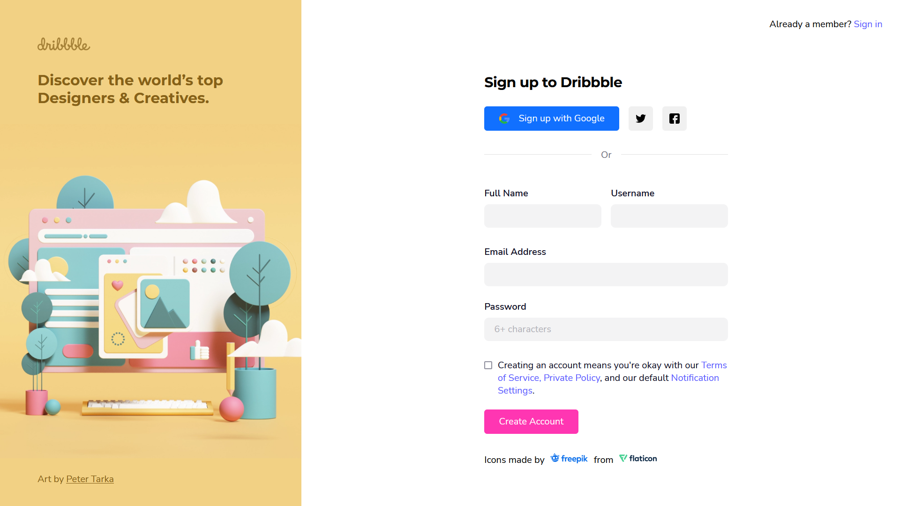

# dribbble-signup-ui-clone

This project is a signup page UI clone of the Dribbble website. The page is created using pure HTML and CSS. And the Mobile-first approach is used to style this page.

If you want to know how to design a sign-up form like a pro then check out the code.

### what is _dribbble_?

Dribbble is a platform form where you can take design inspirations for your next UI design, logo design, etc. If you're a designer, you can create your portfolio on it. It is one of the best design-related platforms out there.

Check out the [dribbble](https://dribbble.com/) website.

## page link

By [Clicking Me](https://msarmadqadeer.github.io/dribbble-signup-ui-clone/) you'll see the live version of this project.

## screenshot

